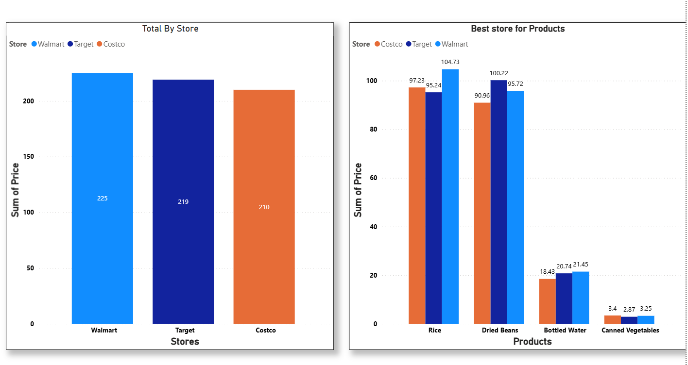

# Apocalypse Food Prep: Power BI Dashboard

## Project Overview
This project was developed to analyze grocery prices across multiple retailers (Target, Walmart, Costco, etc.) to identify the most cost-effective locations for bulk food preparation. The dashboard provides an interactive way to compare total spending and price-per-item across various categories.

### 
*(Note: Upload your screenshot to GitHub and link it here)*

## Tools Used
* **Power BI Desktop:** Data visualization and report building.
* **Power Query:** Data cleaning and transformation.
* **Excel:** Initial data source.

## Data Cleaning & Transformation
Before building the visuals, I performed several data cleaning steps in **Power Query**:
1. **Filtering:** Removed unnecessary items (e.g., milk) to focus on long-term storage items.
2. **Column Transformation:** Renamed columns for better readability (e.g., changing "Store Name" to "Retailer").
3. **Data Types:** Ensured "Price" and "Quantity" columns were set to decimal and whole numbers for accurate calculations.

## Key Insights
* **Retailer Comparison:** Identified which stores offer the lowest prices for specific bulk categories.
* **Spending Trends:** Visualized how different product selections impact the total budget.
* **Optimization:** Developed a strategy for where to buy specific "Apocalypse Prep" items to maximize value.

## How to View
1. Download the `.pbix` file from this repository.
2. Open it using **Power BI Desktop**.
3. If the data doesn't load, update the file path in the 'Data Source Settings' to point to the included Excel file.

---
*Project inspired by the "Alex The Analyst" Power BI tutorial.*
